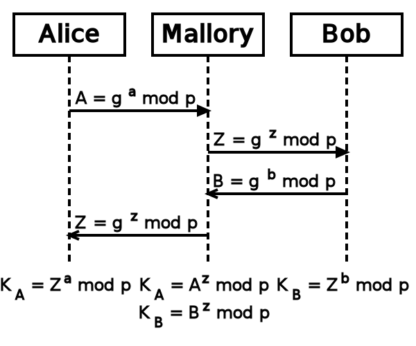

% Sichere Daten ?
% Dr. Günter Kolousek
% Juni, 2014

## Quellen

- Einführung in die Kryptographie, Dipl.-Ing. Otto Horak, 1990
- Geheime Botschaften, Simon Singh, dtv, 1999
- Einführung in die Kryptographie, Johannes Buchmann, Springer, 2008
- Moderne Verfahren der Kryptographie, Albrecht Beutelspacher, Vieweg, 1999
- PGP & GPG - Email for the Practical Paranoid, Michael W. Lucas, No Starch Press, 2006
- Wikipedia
- <http://heise.de/newsticker>


## Agenda

> Linux-centric!

- Sicherheit
- Passwörter
- Sicherheitsanwendungen
- SSH
- GPG --- Dateien
- GPG --- Emails

# Sicherheit

## Überblick

- Einteilung & Begriffe
- Angriffe
- Grundbedrohungen
- Sicherheitsdienste
- Mechanismen

## Einteilung & Begriffe

- Kodierung
    - Eindeutige Zuordnung jedes Zeichens der Def
    - Base64, ISBN, Bytecode, Manchesterkodierung,...
- Steganographie
    - das Verbergen von Botschaften
- Kryptologie
    - das Verbergen des Sinns der Botschaft
    - 2 Teilgebiete
        - Kryptographie
        - Kryptoanalyse

## Kodierung

Base64

- 3 Bytes &#8596; 4 Bytes
- Abbildung von je 6 Bits auf `A`-`Z`, `a`-`z`, `0`-`9`, `+` und `/`
- Füllzeichen ist `=`
- Dekodiere!

    ```
    U2ljaGVyaGVpdCBmw7xyIGFsbGU=
    ```

. . .

```python

>>> import base64
>>> base64.b64decode("U2ljaGVyaGVpdCBmw7xyIGFsbGU=")
```

. . .

```python

b'Sicherheit f\xc3\xbcr alle'
>>> b'Sicherheit f\xc3\xbcr alle'.decode()
'Sicherheit für alle'
```


## Steganographie

- China
    - Botschaft auf Seide &#10137; Kügelchen &#10137; Wachs &#10137; Bote
- 1.JH
    - "Milch" von Thithymallus &#10137; unsichtbare Tinte
- 15.JH
    - Alaun in Essig &#10137; hartgekochtes Ei &#10137; Schale
- 2. Weltkrieg
    - Text &#10137; Foto &#10137; verkleinert &#10137; Punkt
- Heute
    - Bilder, Audio und Video

## Auguste Kerkhoffs von Nieuwenhof

> "Die Sicherheit eines Kryptosystems darf nicht von
> der Geheimhaltung des Algorithmus abhängen.
> Die Sicherheit gründet sich nur auf die Geheimhaltung
> des Schlüssels."


## Kryptographie

- Transposition
- Substitution
- Produktchiffren
- mathematische Probleme


## Transposition

- Bilden einer Permutation des Klartextes
- Zeilenschrift
    - Skytale der Spartaner: Stab aufwickeln &#10137; schreiben &#10137;
        abwickeln
    - Zeilen einlesen, Spalten auslesen
- Zick-Zack-Transposition
    ```
    A       R       M
      L   O   I   H   U
        G       T       S
    ```

## Substitution - 1

monoalphabetisch

- Ersetzen jedes Buchstabens des Klartextes durch ein anderes Symbol
- Julius Caesar: Ersetzung durch Buchstaben 3 Positionen weiter
- Allgemeiner: a &#8596; J, b &#8596; L,...
- Einfacher: Schlüsselwort (ohne Leerzeichen & Wiederholungen), dann
    restlichen Buchstaben

## Substitution - 2

polyalphabetisch

- Chiffrierscheibe von Alberti (15. Jh)
    - Verdrehen um einen Wert nach einigen Worten
- Blaise de Viginère
    ```

       | 0 1 2 3 4 5 6 7 8...
     0 | A B C D E F G H I...
     1 | B C D E F G H I J...
     2 | C D E F G H I J K...
     ...

    Passwort: CABA
    Klartext: DADDI
    Chiffrat: FAEDK
    ```

## Produktchiffren

- Verknüpfung elementarer Krypto-Funktionen
- ADFGVX Chiffre
    ```

       | A D F G V X     Klartext:      S   C   H   U   T   Z
    ---|------------     Substitution: V X F A G A X D X A X X
     A | G 7 E 5 R M
     D | A 1 N Y B 2     Transpositionsschlüssel: 6 1 4 3 2 5
     F | C 3 D 4 F 6     Transposition:  VX FA GA
     G | H 8 I 9 J 0                     XD XA XX
     V | K L O P Q S
     X | T U V W X Z     Chiffrat: XD GX AA FX AX VX
    ```
- 2. Weltkrieg: Enigma
- Heute: DES, Blowfish, Camellia, AES (siehe später)


## Angriffe

- Passive Angriffe
- Aktive Angriffe

## Passive Angriffe

- Abhören von Daten
- Abhören von Teilnehmeridentitäten
- Verkehrsflussanalyse

## Aktive Angriffe

- Modifikation von Daten
- Einfügen oder Löschen von Daten
- Wiederholen oder Verzögern von Informationen
- Verweigerungsangriffe
- Vortäuschen einer falschen Identität
- Leugnen einer Kommunikationsbeziehung


- Trittbrettfahrer (Hijacking)
- Erzeugung von Systemanomalien
- Verändern der Hardware
    - 22.6.2014, Russland: Prozessoren auf ARM Basis

## Grundbedrohungen

- Verlust der Vertraulichkeit
- Verlust der Integrität
- Verlust der Authentizität
- Verlust der Verbindlichkeit
- Verlust der Verfügbarkeit

## Sicherheitsdienste

- Authentifizierung
- Geheimhaltung
- Integrität
- Zugriffskontrolle
- Nicht-Zurückweisung

## Mechanismen

- Symmetrische Verschlüsselung
- Asymmetrische Verschlüsselung
- Message Digests
- Message Authentication Codes
- Digitale Signatur
- Zertifikat

## Zufallszahlen

- Verwendung
- Zufallszahlengeneratoren
    - nicht deterministische
        - Thermisches Rauschen von Widerstand,...
        - (Systemzeit für) Benutzerinteraktion,...
    - deterministische
        - Berechnung &#10137; Startwert
        - &#10137; Pseudozufallszahlen
        - Dual_EC_DRBG: Zufallszahlen &#10137; NSA
            - In Produkten von RSA Security!
        - Mikroprozessorinstruktion (Intel's RdRand)
            - Versuch: Linux Kernel

## Symmetrisch

- Ein Schlüssel je Kommunikationskanal
- basieren auf Substitutionen & Permutationen
- Vorteile
    - schnell
    - auch in Hardware
- Nachteile
    - \# der Schlüssel
    - sichere Kanäle zum Schlüsseltransfer
    - &#10137; Schlüsselverwaltung!

## Symm. Verfahren

- DES (IBM, NSA)
    - 56 Bits &#10137; Aufwand 2^39^ (niedrig)
- 3DES
    - 168 Bits &#10137; 2^112^ (mittel)
- Twofish (Bruce Schneier): kein Patent, public domain!
    - 128, 192, 256 Bits &#10137; 2^256^ (maximal)
- Camellia (Mitsubishi, NTT):
    - 128, 192, 256 Bits &#10137; 2^256^ (maximal)
- And the winner is... &nbsp; AES
    - 128, 192, 256 Bits &#10137; 2^256^ (maximal)

## <u>A</u>symmetrisch

- Schlüsselpaar: öffentlich und privat
- basieren auf mathematischen Problemen
- Vorteil: leichtere Schlüsselverwaltung, aber
    - Authentizität des öffentlichen Schlüssels
    - Zurückziehen eines Schlüssels
- Nachteile
    - langsamer

## <u>A</u>symm. Verfahren

- RSA: Rivest-Shamir-Adleman
    - zerlegen einer Zahl in Primfaktoren
    - 1024, 2048, 4096, 8192 Bits &#10137; 2^167.8^ (maximal)
- ECC (Elliptic Curve Cryptography)
    - diskreter Logarithmus in Gruppe der Punkte auf elliptischen Kurve
    - NIST &#10137; NSA
        - 192/224/256/384/521 Bits &#10137; 2^260.5^ (maximal)
    - Curve25519
        - 256 Bits &#10137; 2^128^ (hoch)

## Schlüsselaustausch

- Mittels Bote, Brieftaube,...
- Shamirs Three-Pass Protocol
- Diffie-Hellman

## Shamirs Three-Pass Protocol

- &#10137; "2 Vorhängeschlösser"
- Vorhängeschloss = Verschlüsselung
- Authentizität ist nicht gewährleistet!
- daher: 2 Attacken möglich...

. . .

- Abfangen des Paketes und versehen mit eigenem Schloss
- Ersetzen des Paketes durch eigenes Paket

## Diffie-Hellman - 1

- Whitfield Diffie & Martin Hellman
- Lösen diskreter Algorithmus
    - prime Restklassengruppe ;-)
    - p ... Primzahl
    - g ... Primitivwurzel
    - Zahlen mit mehreren Hundert Stellen

## Diffie-Hellman - 2


## Man in the Middle




## Message Digests - 1

- MD
- Einwegfunktion, Hash
    - nicht rückrechenbar
    - Ergebnis feste Länge
    - gleichmäßige Aufteilung
        - kleine Änderungen - große Wirkung
- Zweck
    - Integrität
- Verwendung
    - Anhängen
    - separate Übertragung


## Message Digest - 2

- Verfahren
    - (MD5), (SHA-1)
    - SHA-2: SHA-256 (hoch), SHA-384, SHA-512
    - SHA-3: SHA3-256, SHA3-384, SHA3-512
- Abschätzung für SHA-256 (Erde: 2^170^ Atome)
    - 2^30^ Hashwerte pro Sekunde (Radeon HD5830: 622*10^6^/s)
        - 1 Jahr besteht aus 2^25^ Sekunden
    - 2^30^ (ca. 1 Milliarde) Rechner arbeiten gleichzeitig
    - Zeit[Jahr]: 2^256^ / (2^30^ * 2^25^ * 2^30^) = 2^171^ = 2993155353253689176481146537402947624255349848014848
    - Sonne wird in 2^30^ Jahren zur Supernova!


## Message Digest - Praxis

- Lade Gpg4win von <http://gpg4win.org/download.html>
- überprüfe den Message Digest (in Linux):
    ```
    sha1sum gpg4win*.exe
    ```
- überprüfe in Windows:
    ```
    fciv.exe -sha1 gpg4win*.exe
    ```

## Message Authentication Code

- MAC
- wie MD aber Passwort
- Zweck
    - Verifikation der Integrität
    - Symmetrische Form der Authentifizierung
- Verfahren: HMAC


## Digitale Signatur

- Garantie, dass Nachricht
    - von dem Signierer stammt
    - nicht verändert wurde
- Signieren
    - MD erzeugen
    - mit privaten Schlüssel verschlüsseln
- Überprüfen
    - mit öffentlichen Schlüssel entschlüsseln
    - MD berechnen und dann vergleichen
- Eigenschaften
    - nicht fälschbar und nicht abstreitbar
    - einfach überprüfbar
- Verfahren: OpenPGP, X.509


## Zertifikat

- "Digitaler Ausweis"
    - Zusammenhang: öffentlichem Schlüssel & Name
- enthält:
    - Name des Zertifikatsinhaber
    - öffentlicher Schlüssel
    - Name der Zertifizierungsinstanz
    - Gültigkeitszeitraum
    - Verweise auf Zertifikatssperrlisten
- signiert mit privatem Schlüssel der Zertifizierungsinstanz
- Verfahren: OpenPGP, X.509


# Passwörter

## Anforderungen

> - möglichst lang
> - verschiedene Zeichenklassen
> - leicht zu merken
> - nicht mehrfach verwenden
> - regelmäßig ändern
> - nicht aufschreiben

## Tipps

- Groß- und Kleinbuchstaben
- `1` statt `l`, `!` statt `I`, `4` statt `A`,...
- Sonderzeichen wie `"`,`$`,`!`,... einbauen
- keine Umlaute,... &nbsp;&nbsp;&#10137; Kodierung!

&#191; &#191; &#191;

- Wörter aus verschiedenen Sprachen
- Satz jeweils Anfangsbuchstaben

## Aber wie?

- widersprüchliche Anforderungen!
- daher: ein Tool verwenden

. . .

> &#10137; KeePassX
> <br>

. . .

- Win$: <http://www.keepassx.org/>
- Ubuntu bzw. Manjaro: Package Manager

# Sicherheits- anwendungen

## NSL

"National Security Letter"

- Lavabit: &#10013; 2013
- Google
    - 2013: gerichtlich verloren!
    - jedes Jahr: NSLs zwischen 1000 und 3000 Benutzer!
- Microsoft, 2014
    - Herausgabe der Daten eines Geschäftskunden
    - FBI zog NSL zurück
- Nicht nur Server in den USA!
- TrueCrypt?

2000 bis 2013: ca. **300000**!

## Überblick

- Dateiverschlüsselung
- Kommunikation
    - Punkt zu Punkt Verbindung
    - VPN
- Filehosting
- Instant Messaging
- E-Mail-Verschlüsselung

## Dateien

### Windows

Systemeigene Möglichkeiten:

- EFS (basierend auf NTFS)
    - USB Sticks meist FAT
    - keine ganze Partition
- Bitlocker
    - nur ganze Partition
    - auch Systempartition!

Analog für Mac OSX: FileFault

## Dateien

### Linux

- EncFS
    - Verzeichnisse
- LUKS
    - Partition
    - gesamtes System (alle Partitionen)


## Dateien

### Systemübergreifend

- TrueCrypt
    - Container
        - versteckte Container
    - Partition
- OpenSSL
    - Secure Socket Layer
    - TLS: Transport Layer Security
- GPG
    - Gnu Privacy Guard
- ccrypt
    - AES

## ccrypt - 1

> http://ccrypt.sourceforge.net/

- Verschlüsseln
    ```
    ccrypt -e test.txt
    ```

    &#10137; `test.txt.cpt`
- Brute force
    ```
    ccguess test.txt.cpt
    ```
- Entschlüsseln
    ```
    ccrypt -d test.txt.cpt
    ```

## ccrypt - 2

- "gleicher" Schlüssel wie Referenzdatei
    ```
    ccrypt -e test.txt -y test2.txt.cpt
    ```
- Entschlüsseln auf stdout
    ```
    ccrypt -d test.txt.cpt -c
    ```
- Verschlüsseln mehrerer Dateien
    ```
    ccrypt -e test*.txt
    ```
- Linux
    ```
    ccencrypt test.txt
    ccdecrypt test.txt.cpt
    ```
- Hilfe
    ```
    ccrypt -h
    ```

    ```
    man ccrypt
    ```

## Kommunikation

- Punkt zu Punkt Verbindung
    - SSH
    - TLS
- VPN
    - IPsec
    - TLS &#10137; OpenVPN
    - SSH (nur TCP)
- Tor
    - Anonymisierung von Verbindungsdaten

## TLS

- SSL ... Secure Socket Layer
    - SSL 3.1 = TLS 1.0
- Authentifizierung des Servers
    - asymmetrisch mittels Zertifikaten
- Symmetrische Verschlüsselung der Kommunikation
    - Diffie-Hellman Schlüsselaustausch
- https
    - https = https über TLS
    - Sollte möglichst immer verwendet werden
    - Leider auch nicht "absolut" sicher
- &#10137; Heartbleed-Bug von OpenSSL (2014)
    - Heartbeat: Keine Überprüfung der Länge

## Filehosting

- Spideroak (closed source, USA)
- Wuala (closed source, Schweiz)
- Seafile (open source)


- Boxcryptor (closed source, DE)
    - Verschlüsselung für "alle" Filehoster
        - Dropbox, Google Drive,...

## E-Mail

- Leitungsverschlüsselung
    - TLS mittels STARTTLS
- Ende zu Ende Verschlüsselung
    - OpenPGP
    - S/MIME
    - Nachteile
        - unsicher: Verbindungsdaten, Header
        - "komplizierte Bedienung"
- Verschlüsselte E-Mail-Provider...
    - Lavabit

## Sonstige Anwendungen

- Anti-Virus
- Firewalls
- Intrusion Detection System
- Audit-Tools


## Instant Messaging

- Pflicht
    - end-to-end Verschlüsselung
    - authentifiziert
- Kür
    - kein zentraler Server
    - Forward Secrecy
        - kein Zugriff auf alte Chat-Sessions
    - Multi-Encryption
- Systeme
    - Threema (anstatt Whatsapp)?
    - <https://crypto.cat/>
        - Firefox, Chrome, Safari, Opera
        - iPhone! Android is coming soon.

# SSH

## Prinzipien

- TCP, Port 22
- Authentifizierung des Servers
    - mittels Public Key
    - Fingerprint
- Verschlüsselte Verbindung
    - Diffie-Hellman Schlüsselaustausch
    - symmetrische Verschlüsselung
- Authentifizierung des Benutzers
    - Passwort
    - Public Key


## OpenSSH

- ssh
    - Ausführen von Befehlen und tunneln
- scp, sftp
    - Kopieren von Dateien
- ssh-keygen
    - Generieren von Schlüsseln
- ssh-keyscan
    - Auslesen von öffentlichen Schlüsseln
- ssh-agent
    - Hält privaten Schlüssel im Arbeitsspeicher
- ssh-add
    - privaten Schlüssel zu ssh-agent hinzufügen

<!--
http://www.jfranken.de/homepages/johannes/vortraege/ssh1_inhalt.de.html
http://www.jfranken.de/homepages/johannes/vortraege/ssh2_inhalt.de.html
-->

## SSH - Windows

- cygwin
    <https://www.cygwin.com/>

<br/>
*oder*
<br/><br/>

- PuTTY
    <http://www.putty.org/>
- WinSCP
    <http://winscp.net/>


## OpenSSH - Praxis 1

1. Löschen des Verzeichnisses `~/.ssh`
    - `rm -r ~/.ssh`
2. Anmelden am edvossh
    - `ssh ko@edvossh.htlwrn.ac.at`
    - Fingerprint (siehe später)!
3. "Schützen" von `~/.ssh`
    - `chmod -R go= ~/.ssh`
4. Abmelden
    - `exit`
5. Ansehen der Datei `known_hosts`
    - `cat ~/.ssh/known_hosts`
6. Nochmals anmelden: Kein Fingerprint!

## OpenSSH - Praxis 2

1. **edvossh**
    - `rm ~/.ssh/authorized_keys`
2. Keys generieren (vorerst keine Passphrase)
    - `ssh-keygen`
    - `cat ~/.ssh/id_rsa`
    - `cat ~/.ssh/id_rsa.pub`
3. Öffentlichern Key auf Server kopieren
    - `ssh-copy-id ko@edvossh.htlwrn.ac.at`
4. **edvossh** (Kein Passwort mehr!)
    - `cat authorized_keys`
5. SSH Key eines entfernten Rechners abfragen
    - `ssh-keyscan edvossh.htlwrn.ac.at`

## OpenSSH - Praxis 3

*Key darf **NIE** verloren gehen &#10137; Passphrase*

1. Key generieren: Überschreiben! Mit Passphrase!
2. Key auf Server (Passwort: wieder einzugeben!)
    - `ssh-copy-id ko@edvossh.htlwrn.ac.at`
3. An edvossh anmelden & danach abmelden
    - Passphrase ist einzugeben!
4. SSH agent starten (wenn nicht läuft)
    - ``ssh-agent `which bash` ``
    - oder wenn Fish Shell: `ssh-agent (which fish)`
5. Passphrase dem Agent mitteilen
    - ``ssh-add``
6. edvossh anmelden: keine Passphrase notwendig


## OpenSSH - Praxis 4

1. Zum edvossh kopieren
    - `scp test.txt ko@edvossh.htlwrn.ac.at:`
2. Vom edvossh kopieren
    - `scp ko@edvossh.htlwrn.ac.at:test.txt .`
3. Anzeigen des Fingerprints
    - `ssh-keygen -l -f ~/.ssh/id_rsa`
4. Nachträgliches Ändern der Passphrase
    - `ssh-keygen -p -f ~/.ssh/id_rsa`
5. Public key nachträglich erzeugen
    - `ssh-keygen -y -f ~/.ssh/id_rsa`


## Lokales Tunneln - 1

- Annahme
    - www.htlwrn.ac.at Port 80 ist hinter Firewall (unsinnig!)
- Lösung
    - `ssh -N -L 8080:www.htlwrn.ac.at:80 ko@edvossh.htlwrn.ac.at`
    - `-N` ... es werden keine Kommandos ausgeführt
    - `-L` ... lokales port forwarding
    - `-C` ... komprimiert die Daten
    - `-f` ... schickt ssh in den Hintergrund

## Lokales Tunneln - 2

- Annahme
    - Webserver auf edvossh.htlwrn.ac.at ist hinter Firewall
        - *kein Webserver am edvossh!*
- Lösung
    - `ssh -N -L 8080:localhost:80 ko@edvossh.htlwrn.ac.at`

. . .

- Annahme
    - Lokalen Port auf entfernten Port umleiten (kein Tunneln)
- Lösung
    - `ssh -N -L 8080:www.htlwrn.ac.at:80 localhost`
    - ungesichert!
    - ssh Server auf localhost!

## Entferntes Tunneln

- Annahme
    - Lokaler Rechner und Webserver hinter Firewall
    - Zugriff auf Webserver von Home-PC
- Lösung
    - `ssh -N -R 8080:webserver:80 homepc.at`
    - Webbrowser am Home-PC kann über Port 8080 auf Webserver zugreifen

# GPG --- Dateien

## GPG

- PGP
    - 1991: Phil Zimmermann
- Open PGP
    - PGP: Pretty Good Privacy
    - GPG: Gnu Priacy Guard
- Anwendungsgebiete
    - Verschlüsselung von Daten: E-Mail, Datei
    - Signaturen: Erstellung, Verifikation

## World of Trust

- öffentliche Schlüssel z.B. auf Keyserver
- Authentizität des Schlüssels?
    - gehört Schlüssel wirklich zu der Identität?
- 2 Möglichkeiten
    - vertrauenswürdige Zertifizierungsstelle
    - WoT
- WoT
    - XXX

## Installation

- MacOSX, Linux...: Paketmanager deiner Wahl!
- Windows: Gpg4win <http://www.gpg4win.de/>
    - GPG
    - Kleopatra, GPA: Zertifikatsmanager
    - GggOL: Plugin für Outlook
    - GpgEX: Erweiterung für Explorer zur Dateiverschlüsselung
    - Claws-Mail: E-Mail-Programm
    - Gpg4win-Kompendium: Dokumentation
- Thunderbird: Add-on

# GPG --- Email

## Nachrichten versenden

1. Alice sendet K~pub~ an Bob
    - optional: K~pub~ an Keyserver
2. Bob fügt K~pup~ zu Schlüsselring hinzu
3. Bob sendet an Alice
    - verschlüsselt mit K~pub~ von Alice
3. Alice entschlüsselt mit K~priv~

&#10137; Praxis!

## Feind lauscht mit...

1. Alice sendet K~pub,B~ an Bob
2. Mallory kontrolliert Kanal
    - tauscht K~pub,B~ gegen K~pub,M~ aus
3. Alice fügt K~pub,M~ zum Schlüsselring hinzu
4. Alice sendet verschlüsselte E-Mail an Bob
5. Mallory fängt E-Mail ab und kann Inhalt lesen

## Zertifizierungsstelle

- Certificate authority (CA)
- Stellen Zertifikate aus
- Firmen oder öffentliche Organisationen
- Benutzer muss diesen Stellen vertrauen
    - kommerzielle Anbieter &#10137; Geld
- Öffentlicher Schlüssel einer CA?
    - sicherer Kanal
    - Zertifikat einer "höheren" CA
- sind besondere Angriffspunkte!
- und was ist bei Fehlern?!

## Web of Trust (WOT)
